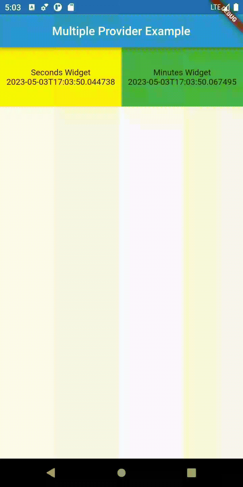

# Provider State Management

Provider is a 3rd party package available from pub.dev. This package allows you to create providers of type ChangeNotifier and ValueNotifier for instance, and send them down the BuildContext path for consumers to use. One of the beautifies of the Provider package is its ability to re-draw a widget by simply using .watch() or .select() in the build() method of your widget!

Provider will greatly simplify your state management in your Flutter applications.

## Projects Table of Content

1. testingprovider_course
1. detailsofprovider_course
1. mutilprovider_course

| testingprovider_course                                       | detailsofprovider_course                                     | mutilprovider_course                                         |
| ------------------------------------------------------------ | ------------------------------------------------------------ | ------------------------------------------------------------ |
|  |  |  |

