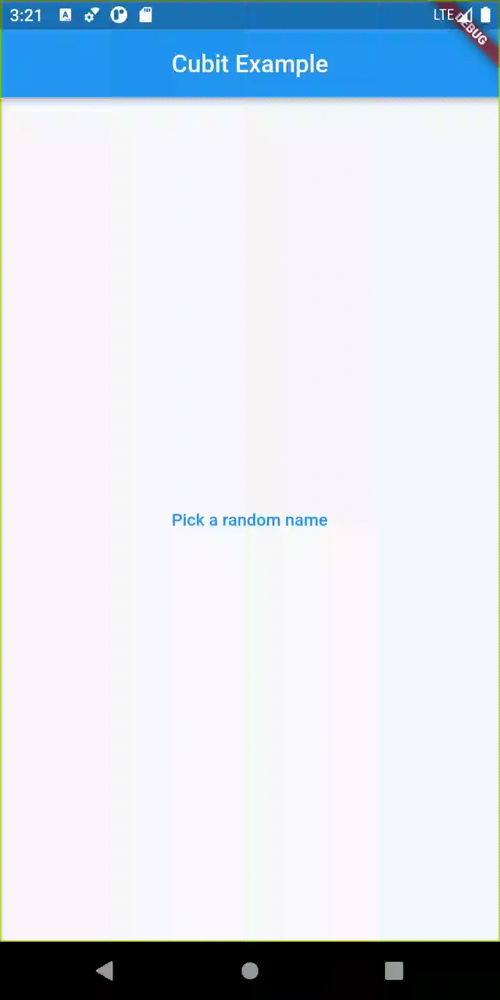

# Bloc State Management

Bloc and Flutter Bloc are two very popular and useful libraries for Dart and Flutter developers respectively. They allow you to separate your business logic from your application's UI to an extent UI work is greatly simplified thanks to the simplicity of integrating Bloc and Flutter Bloc into an application.

# Getting Started

Each step of the course is in its own tag and commit so either check the various commits out or go to various tags.

I have deleted the Firebase project backing this app for security reasons so before you get started, set up your firebase backend as shown in the video of course (https://youtu.be/Mn254cnduOY)

# Table of Content

1. [Cubit Example](./cubitexample_course/)
1. [First Bloc Example](./firstblocexample_course) with Testing

# Examples

| [Name]()                                                     | Description                                                  | Features                                                     | Demo                                                         |
| ------------------------------------------------------------ | ------------------------------------------------------------ | ------------------------------------------------------------ | ------------------------------------------------------------ |
| [Cubit Example](./cubitexample_course)                       | Just a simple easy cubit example.                            | Cubit, Stream, StreamBuilder                                 |      |
| [First Bloc Example](./firstblocexample_course) with Testing | Display two list of users data that fetched form network and cached by Bloc. | API by Live Server, caching data with Bloc                   |  |
| [Bloc Notes App](./notes_app)                                | A Bloc that has multiple states, it's gonna hold on a variable knowing whether you're longged or not, and also allow you to fetch some notes. | Login with dummy api, Only One BlocProvider, Dependency Inject |                                                              |
|                                                              |                                                              |                                                              |                                                              |

# Source Code

Checkout [youtube-course-bloc](https://github.com/vandadnp/youtube-course-bloc) repository of this course by [Vandad Nahavandipoor](https://www.youtube.com/@VandadNP)
