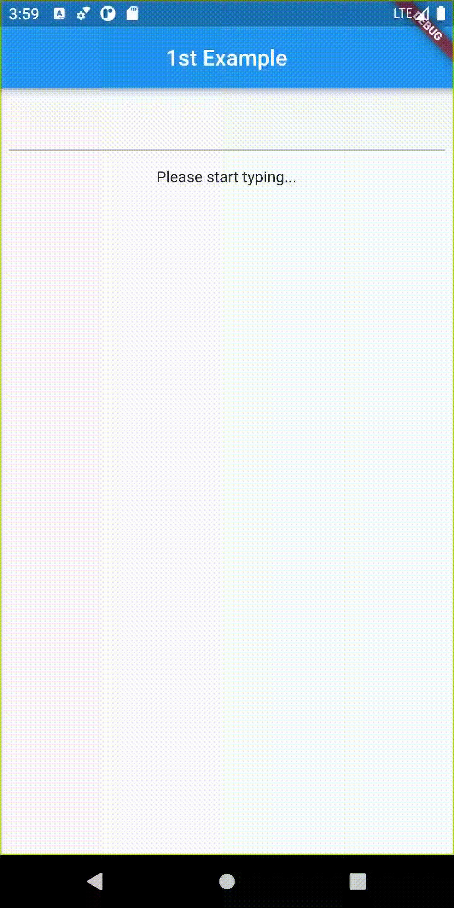
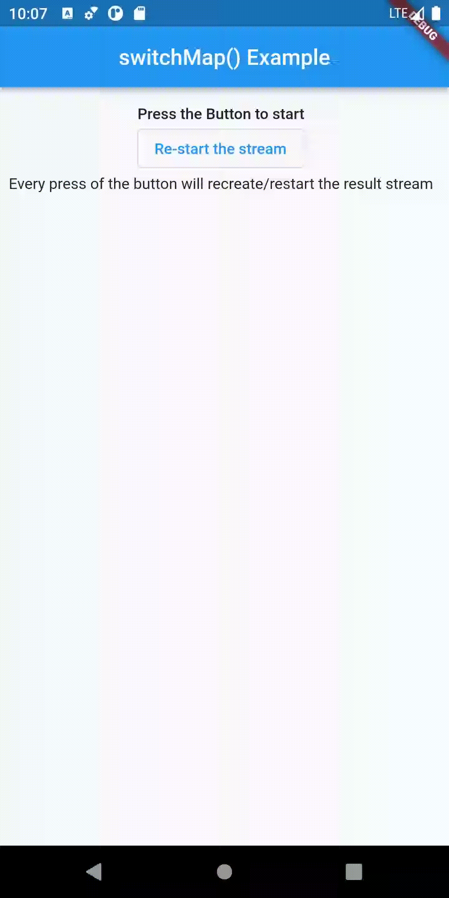
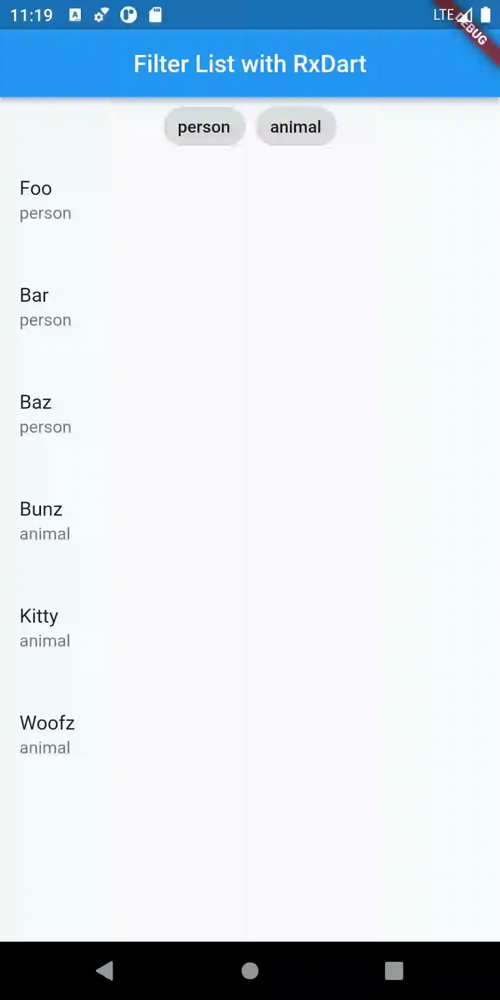
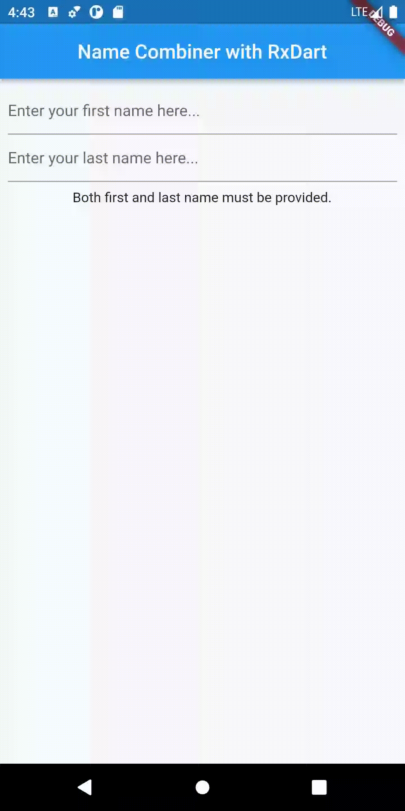
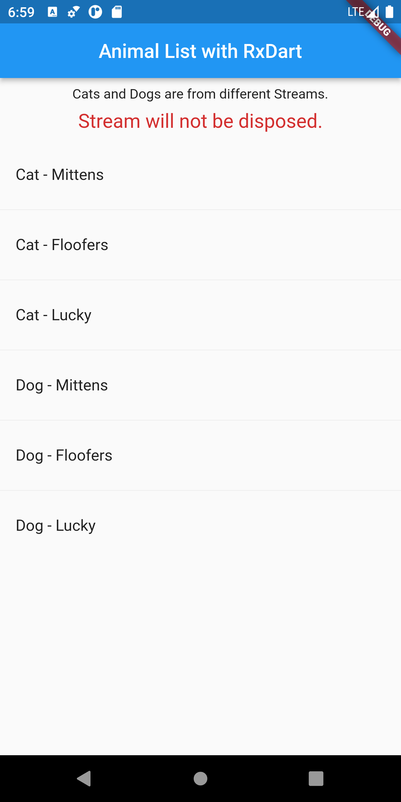

# RxDart State Management

Rx is a reactive paradigm that builds on top of streams and futures in Dart. These streams are also called Observables in other implementations of Rx, such as RxSwift. 

In this chapter of the Flutter State Management Course we will work on RxDart and we will create 11 different applications. The last application we will create will be a fully fledged app with Firebase integration together with authentication and storage. 

In this chapter we create business logics (or blocs) with RxDart. To be clear, we are not using the Bloc package at all in this chapter. Bloc is a term generally used as an abbreviation of business logic so you don't need to know about the Bloc package in order to learn this chapter.

# Examples

| Name                                                  | Description                                                  | Points                                                       | Demo                                                         |
| ----------------------------------------------------- | ------------------------------------------------------------ | ------------------------------------------------------------ | ------------------------------------------------------------ |
| [Example1 (With flutter_hooks)](./example1_get_start) | RxDart getting started                                       | BehaviorSubject, distinct(), debounceTime()                  |        |
| [Example2](./example2_bloc_search)                    | Search App with BloC Pattern                                 | BloC Pattern, Rx.fromCallable(), delay(), startWith(), onErrorReturnWith() |  |
| [Example3](./example3_combineLatest)                  |                                                              | combineLatest()                                              | TODO: A filterable shop list with some switch buttons or A BMI calculator |
| [Example4](./example4_concat)                         |                                                              | take(), concat(), also see switchMap()                       | TODO: Call a  API with param that produced by anthoer API's result |
| [Example5](./example5_merge)                          |                                                              | merge()                                                      | TODO: Build a message list from two or more users            |
| [Example6](./example6_zip)                            |                                                              | zip()                                                        | TODO: ...                                                    |
| [Example7](./example7_switch_map)                     | Every press of the button will recreate/restart the result stream | switchMap()                                                  |  |
| Example8                                              | Display a list of "things", and filter them using a FilterChip with BloC pattern | BloC Pattern, StreamBuilder,  BehaviorSubject, debounceTime(), map(), startWith() |  |
| Example9                                              | Two text fields for first name and last name, after both of them are typed, show the name combined. | BLoC Pattern, BehaviorSubject, combineLatest()               |  |
| Example10                                             | Concat two streams to one stream using concat(), and display values of the result stream in a ListView. | concatWith()                                                 |  |
| Example11                                             | Build a fully fledged contacts app with Firebase integration together with authentication and storage. ([see more about this app](./rxdart_contacts/README.md)) |                                                              |                                                              |

# Resources

- [RxDart with BLoC Pattern in Flutter > Toshal Infotech](https://www.toshalinfotech.com/Blogs/ID/225/RxDart-with-BLoC-Pattern-in-Flutter)

# Source Code

Checkout [youtube-course-rxdart](https://github.com/vandadnp/youtube-course-rxdart) repository of this course by [Vandad Nahavandipoor](https://www.youtube.com/@VandadNP)

