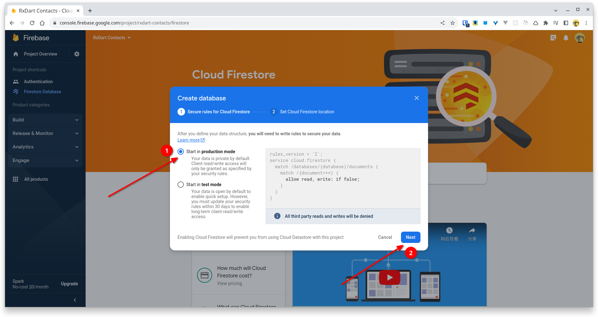
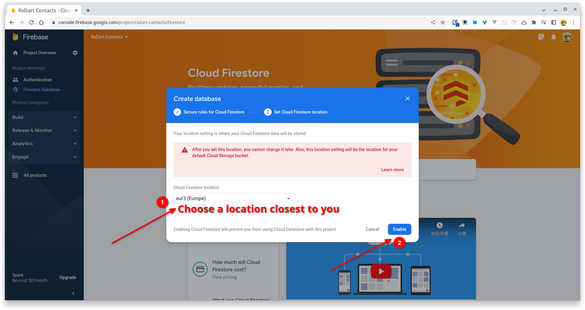
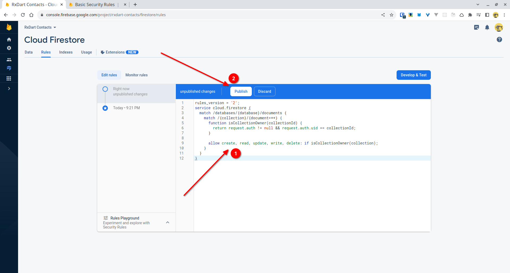
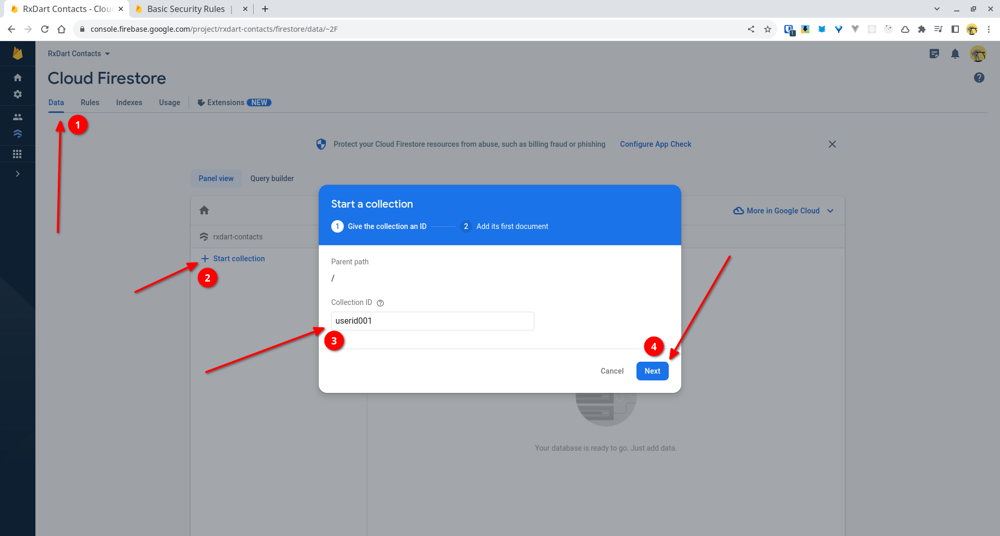
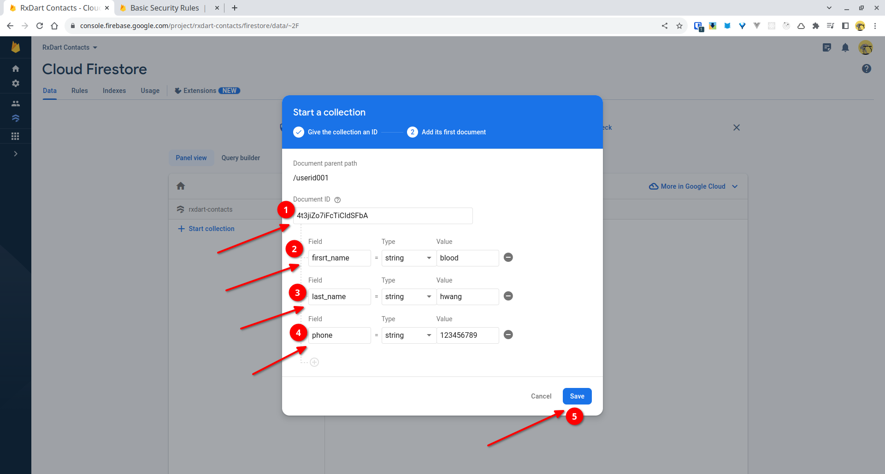
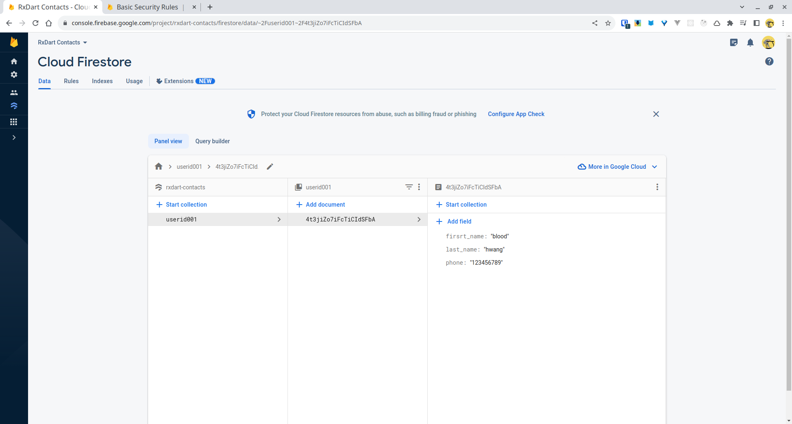

Edit rules:



```
rules_version = '2';
service cloud.firestore {
  match /databases/{database}/documents {
    match /{collection}/{document=**} {
    	function isCollectionOwner(collectionId) {
      	return request.auth != null && request.auth.uid == collectionId;
      }
      // the update rule includes delete rule, so the delete rule in no-need here
      allow create, read, update, write, delete: if isCollectionOwner(collection);
    }
  }
}
```


After publishing above rules, you can create ducuments in Firestore:






