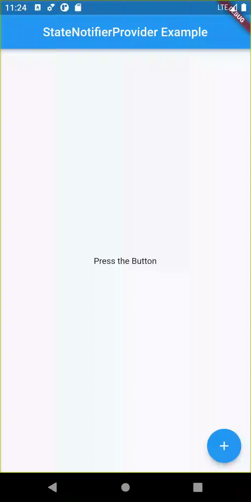

# Riverpod State Management

Welcome to this massive course on Riverpod 2.x. We will implement an Instagram photo and video sharing application with Riverpod in this course using social sign-ins such as Facebook and Google! We use Firebase Firestore to store our documents and Firebase Storage to store photos and videos.

**How is the course structured?** 

We start off by creating 6 example applications using Riverpod before we get to the Instagram implementation. The examples get progressively more difficult so grab a cup of coffee or tea!

**Who is this course for?** 

This course is for those who want to either learn Riverpod from scratch or  I assume that you are already quite comfortable with Flutter and don't need explanation as to how to use basic Flutter widgets such as Row and Column. We will also use Flutter Hooks in small portions of our app. Knowledge of Flutter Hooks is not at all required in order to take this course on Riverpod! However, if you are are curious about Flutter Hooks and want to learn it from the ground up, you can watch Vandad's free full course on it by following this link [https://youtu.be/XsbxM1Aztpo](https://www.youtube.com/watch?v=XsbxM1Aztpo&t=0s)

# Examples

| Name                                        | Description                                                  | Features                                                     | Preview                                                      |
| ------------------------------------------- | ------------------------------------------------------------ | ------------------------------------------------------------ | ------------------------------------------------------------ |
| [Provider Example](./example1)              | Basic Provider (Just provide a value, nothing special)       | Provider                                                     |                                                              |
| [StateNotifierProvider Example](./example2) | Store count in a StateNotifier, and listen to its change of state with StateNotifierProvider. | StateNotifier (in package state_notifier), StateNotifierProvider |  |
|                                             |                                                              |                                                              |                                                              |
|                                             |                                                              |                                                              |                                                              |
|                                             |                                                              |                                                              |                                                              |
|                                             |                                                              |                                                              |                                                              |

# Source Code

Checkout [youtube-riverpodcourse-public](https://github.com/vandadnp/youtube-riverpodcourse-public) repository of this course by Vandad Nahavandipoor
